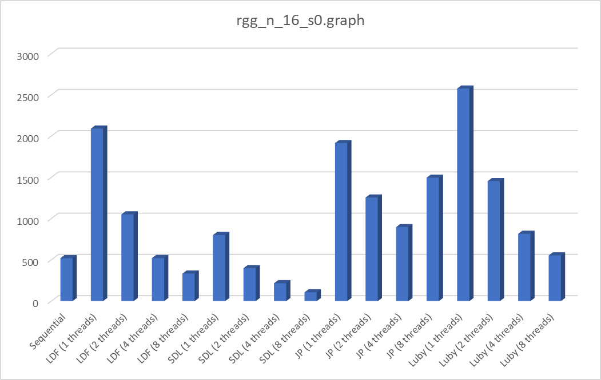
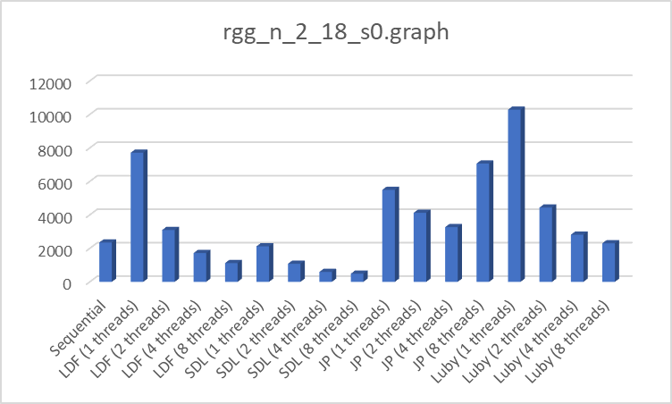
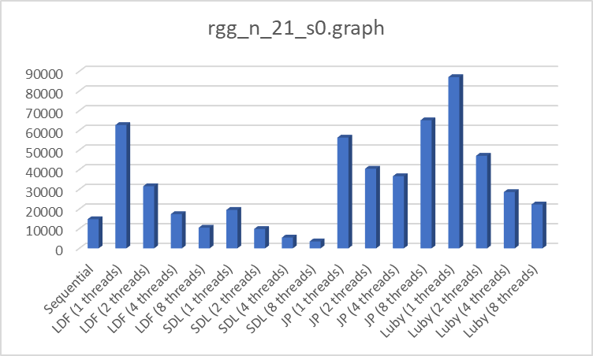
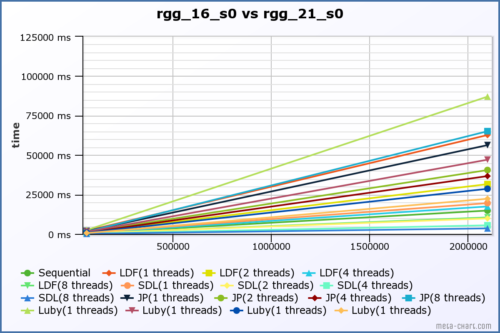

# ParallelGraphColoring

ParallelGraphColoring is a project focused on the implementation and analysis of sequential and parallel algorithms used
to color graphs.

The project is entirely written in c++.

# Introduction

In graph theory, graph coloring is a special case of graph labeling; it is an assignment of labels traditionally
called "colors" to elements of a graph subject to certain constraints. In its simplest form, it is a way of coloring the
vertices of a graph such that no two adjacent vertices are of the same color; this is called a vertex coloring.
Similarly, an edge coloring assigns a color to each edge so that no two adjacent edges are of the same color, and a face
coloring of a planar graph assigns a color to each face or region so that no two faces that share a boundary have the
same color.

The convention of using colors originates from coloring the countries of a map, where each face is literally colored.
This was generalized to coloring the faces of a graph embedded in the plane. By planar duality it became coloring the
vertices, and in this form it generalizes to all graphs. In mathematical and computer representations, it is typical to
use the first few positive or non-negative integers as the "colors". In general, one can use any finite set as the "
color set". The nature of the coloring problem depends on the number of colors but not on what they are.

# Main Design Choices

## Graph

The graph is implemented by means of two classes: Graph and Vertex. Each Vertex has as properties an id, a color and a
vector of other vertices, containing its neighbors. Because of this choice, we had decided that the explicit
implementation of the edges was not necessary, since the vertices are already linked together.

The Graph attributes are two vectors: the first one contais the colors progressively used and inserted by the running
algorithm, the second one is the full list of the vertices.

## Parsing

Parsing is implemented in two different ways according to the tipology of graph storage.

`Dimacs` and `Dimacs-10` formats are exploit. The extension file of the two format are `.gra` and `.graph` respectively.
The classes Dimacs10Parser and DimacsParser in the `parse/` directory implement the algorithm to generate graphs from
files.

### Parser

The two implemented parser are both a specialization of `Parser` class. Then the parser class implements the `IParser`
interface.

Parser job is to run the right parser according to the right extension of the given file (from the command line) and
give as result the parsed graph.

### DimacsParser

The `Dimacs` format stores graph with an adjacency list, the first line contains the number of vertices. Then for each
line there is the list of IDs neighbors for the i-th vertex. Each line terminates with `#`. Note that given two
neighbored vertices with IDs i and j, such that i < j, the neighborhood is explicitly shown only once in the list of
neighbors of the i-th vertex. So it is necessary to add i-th vertex as j-th neighbor. This make the algorithm much more
expensive in term of time and memory usage. There is an example of a `.gra` file and its content:

```
10
0: 3 8 5 #
1: 2 8 5 9 #
2: 8 5 #
3: 7 6 9 8 4 5 #
4: #
5: 7 9 8 6 #
6: 9 7 8 #
7: 8 9 #
8: 9 #
9: #
```

### Dimacs10Parser

The `Dimacs10` format stores gaph with an adjacency list, the first line contains the number of vertices and optionally
the number of edges (ignored due to the graph implementation). Then for each line there is the list of IDs neighbors for
the i-th vertex. Differently from the previous format the neighborhood is shown twice, so two near vertices appears in
both neighbors list. For this reason the algorithm is cheaper than the previous case in terms of memory usage and
time.

There is an example of `.graph` file and its content:

```
5 4
2 3
1 4
1 5
2
3 
```

## Parallelization

The main concept used in distributing the work within threads is the partition in range of the graph's vertex. Thanks to
the class `Splitter`, the graph is divided in a number of sets equal to the number of threads, and each thread is
assigned a specific range [from, to), in which perform the running algorithm.

This method avoids conflicts while using common data, and consequently reduces the need of complex synchronization
structures.

## Algorithms

All the algorithms are implemented as specialization classes of the `Algorithm` class. It declares two virtual methods:

* void algorithmSolver(Graph &);
* string name() const;

The *algorithmSolver* function must contain the full logic of that algorithm, to be triggered by the `Resolve` class.
Each class that corresponds to an algorithm that can be run in parallel has a constructor to specify how many threads to
launch.

# Project Structure

The projects is composed of several directories:

* `classes/`
* `algorithms/`
* `tools/`
* `parse/`
* `resolve/`

## Classes

Contains the definition of vertex (`Vertex.h/cpp`), and graph (`Graph.h/cpp`), as previously described.

## Algorithms

Algorithms definition and implementation are exposed in the `algorithm/` folder.

### Sequential

The sequential algorithm implements the well-known greedy strategy shown in the document _A Comparison of Parallel Graph
Coloring Algorithms, J. R. Allwright, 1995_.

It is sequential, so it runs with a single thread. The algorithm consists of choosing a random permutation of the vertex
IDs. Then for each vertex assign the resulting permutation and color the vertex with the smallest color among its
neighbors. The smallest color is found and assigned through the following algorithm in the `Graph` class:

```
int Graph::assign_color(Vertex v) {
    std::set<int> neighbor_colors;
    for (Vertex n: v.getNeighborList()) {
        neighbor_colors.emplace(colors[n.getId()]);
    }

    int min_color = 0;
    for (int n_color: neighbor_colors) {
        if (min_color != n_color)
            break;
        else
            min_color++;
    }
    colors[v.getId()] = min_color;
    return min_color;
}
```

### Largest Degree First

The Largest Degree First algorithm implements the algorithm exposed in the document _A Comparison of Parallel Graph
Coloring Algorithms, J. R. Allwright, 1995_.

The algorithm chooses to color vertices considering their degrees. The coloring strategy priority is given to vertices
that have largest degrees. It is parallelized among the number of threads that are given and each thread job is to
assign colors to the subset of vertices it has to work on. The strategy is to assign the right color according to the
startegy described before.

### Smallest Degree Last

The Smallest Degree Last algorithm implements the algorithm exposed in the document _A Comparison of Parallel Graph
Coloring Algorithms, J. R. Allwright, 1995_.

The algorithm follows the same strategy adopted by the LDF, but in this case it uses also weights to
decide which vertex to color firstly.

The flow of the algorithm is composed of two phases:

1) `weighting phase`: find all the vertices with degree equal to the smallest degree in the graph. These vertices are
   assigned the current weight and then removed from the graph. The process is repeated until there are sets of vertices
   with a unique weight.
2) `coloring phase`: colors the sets provided from the previous step starting from the largest weight.

### MIS_Sequential

The class `MIS_Sequential.h/.ccp` implements the basic algorithm to find a maximal indipendent set in a graph, as it was
explained into the `allwrigth1995.pdf`. As the name suggest, this algorithm is sequential and no parallelism is
provided.

Firstly, it is called the method *find_MIS_Sequential* to fully process the graph, and to insert all the indipendent set
in a variable <set< set< int>> mis. The indipendent sets are found by restricting the list of available vertices at each
iteration, deleting all the neighbors of the current vertex.

Once this process ends, the mis variable is explored and a color is assigned to each set using the function *color_MIS*.

Even if this algorithm works, we have decided to not include it into the results because it is very slow, and it is due
to the data structures we choose at the beginning of the project.

### Jones Plassman

The Jones-Plassman algorithm is implemented by the `JP.h/.cpp` class, and it is based on the concept of MIS, but it is
quite different, also considering that is a concurrent algorithm. The implementation is based on the explanation
available in `allwrigth1995.pdf`.

The criteria for choosing the nodes to insert into the indipendent set is made by assigning to each vertex a random
weight when the algorithm starts. Specifically, the vector<int>
assigned_vertices is filled by each thread in its range [from, to) using *assign_randomNum_to_vertices*

    void JP::assign_randomNum_to_vertices(int from, int to, std::vector<int> &assigned_vertices) {
    
        srand(time(0));
    
        for (int i = from; i < to; i++) {
            assigned_vertices[i] = rand();
        }
    }

Then it is invoked *find_and_color_MIS*, and the search of a candidate is based on the result of the function *
isMax_between_neighbor* : the current vertex is chosen only if the value of its associated random number is the highest
respect to the neighbors one. After this check, the vertex can be colored immediatly.

Since the graph's vector of colors is a shared resource, this last operation is protected using a mutex.

    if (isMax) {
       color_mutex.lock();
       graph.assign_color(verticesList->at(j));
       assigned_vertices[cur_node_id] = 0;       //the next iteration it won't be the max
       color_mutex.unlock();
        ...

The algorithm ends when all threads have colored their vertices.

### Luby

The Luby algorithm is implemented by the `Luby.h/.cpp` class, referring to the description made in `allwrigth1995.pdf`.
It is a parallel algorithm and it has lot in common with the Jones-Plassman.

In fact, in both cases a random weight is associated to all vertices and then it is needed a search of the maximum value
between neighbors, but here the weights are produced by performing a permutation of the vertices ids.

Another important difference respect to the Jones-Plassman is that we introduce again the variables set< set< int>> mis
and the current indipendent set I, like in the MIS_Sequential. However, since the Luby is a concurrent context, they are
shared resources, and a stronger synchronization is needed.

We've chosen an implementation with a condition variable and an int semMIS;

    //at this point a MIS is found
        std::unique_lock <std::mutex> lock(I_mutex);
        semMIS--;

        if (semMIS <= 0) {
            //Insertion of indipendent set into mis
            mis.insert(I);
            graph.addColor(max_color);
            max_color++;
            I.clear();
            if (num_remain == 0) {
                running_threads--;
            }
            semMIS = running_threads;
            mis_cond_var.notify_all();

        } else {

            if (num_remain == 0) {
                running_threads--;
            }
            mis_cond_var.wait(lock);
        }

In this way the thread that first completes the assigment of its vertices will wait until the last thread inserts the
found indipendent set into the mis, and clear it for the next iteration.

## Tools

### Splitter
The `Splitter` class is used to split a range into equal parts. This is useful to equally assign each threads a set of vertices to work on.
`VectorSplitter` is applied to vectors and its main function is the one to return a span (supported with `span.hpp`) for the given thread.

### Memory
The `Memory` class is used to monitoring the memory usage of the different executions when the programm is running.
Its main function is to compute the actual memory usage of the program (before a single algorithm runs) and the total memory usage after algorithm execution.
The single memory usage of the given algorithm is computed by the `stop()` method that returns the difference between the total memory usage and the current one.

All this was possible through the use of `ifstream` library and `proc/self/statm` that shows some information about the running process, including data size occupied.

### OutputCsv
The `OutputCsv` is a simple class that writes on a `.csv` file the results obtained for each given graph.

## Resolve
The `Resolve` class is used to run both single algorithms (with all chosen thread) and general simulation with all algorithms (and their threads).

In the class there is also the computation of the time elapsed for eaxh execution, performed with `crono` library.

# Experimental Evaluation

All the algorithms and the graph implementation are run and tested. The performace of each algorithm are evaluated
considering three properties:

* Time elapsed
* Memory usage
* Number of colors used

The running simulation was performed on a _AMD Ryzen 7 4800H, 2.9 GHz, 16 threads, 8 CPU cores_.

The results are exposed in the `outputs/` folder that contains a `.csv` file for each benchmark runned. Each file
contains the report in terms of time elapsed, memory usage and number of colors used for each algorithm (togheter with
the number of threads).

Finally, in the follow there is a description of the results obtained with several graph with different sizes and a
comparison between the different algorithms. The purpose of this simulation is to find the algorithm with the best
performance according to the properties written before.

Note that the memory usage is not correct for some results because the allocator sometimes does not free memory for future use.

### rgg_n_16_s0.graph

This is a graph of 65536 vertices and 342568 edges.

|algorithm_name  |time    |mem_usage |num_colors|
|----------------|--------|----------|----------|
|Sequential      | 520.396| 0.367188 | 18       |
|LDF (1 threads) | 2091.97| 8.51562  | 16       |
|LDF (2 threads) | 1051.54| 8.26562  | 16       |
|LDF (4 threads) | 521.977| 16.2812  | 16       |
|LDF (8 threads) | 333.921| 0.515625 | 16       |
|SDL (1 threads) | 801.347| 0        | 16       |
|SDL (2 threads) | 399.006| 0        | 16       |
|SDL (4 threads) | 216.712| 0.0703125| 16       |
|SDL (8 threads) | 106.524| 0        | 16       |
|JP (1 threads)  | 1916.73| 22.0078  | 16       |
|JP (2 threads)  | 1255.64| 25.9961  | 17       |
|JP (4 threads)  | 896.861| 47.6289  | 17       |
|JP (8 threads)  | 1496.58| 95.8125  | 16       |
|Luby (1 threads)| 2577.45| 2.48438  | 26       |
|Luby (2 threads)| 1454.59| 0        | 27       |
|Luby (4 threads)| 816.104| 0        | 30       |
|Luby (8 threads)| 554.341| 0        | 34       |



As it is shown on the chart and on the results table, the algorithm that seems to perform better is the Smallest Degree Last algorithm.
In general each algorithm increase its own performance when the number of threads running is higher, at expense of an higher usage of memory. However, the worst algorithm in terms of time elapsed is Luby with a single thread.
Luby has a particular trend in its performance: with a single thread is the worst algorithm but with higher thread becomes faster than other algorithms like JP. At the other hand JP is the worst algorithm in time elapsed with 8 threads execution.

###rgg_n_18_s0.graph

This is a graph of 524288 vertices and 6561433 edges.

|name            |time    |mem_usage |num_colors|
|----------------|--------|----------|----------|
|Sequential      | 2347.99| 1.10156  | 19       |
|LDF (1 threads) | 7711.51| 10.0195  | 18       |
|LDF (2 threads) | 3093.83| 9.01953  | 18       |
|LDF (4 threads) | 1718.7 | 17.0312  | 18       |
|LDF (8 threads) | 1118.85| 1.0625   | 18       |
|SDL (1 threads) | 2119.06| 1.50391  | 18       |
|SDL (2 threads) | 1079.9 | 0        | 18       |
|SDL (4 threads) | 591.981| 0.5      | 18       |
|SDL (8 threads) | 483.753| 0        | 18       |
|JP (1 threads)  | 5491.73| 63.7344  | 19       |
|JP (2 threads)  | 4122.14| 62.9805  | 17       |
|JP (4 threads)  | 3264.4 | 125.465  | 21       |
|JP (8 threads)  | 7064.58| 252.684  | 19       |
|Luby (1 threads)| 10280.1| 9.88281  | 29       |
|Luby (2 threads)| 4434.26| 0        | 32       |
|Luby (4 threads)| 2813.86| 0        | 34       |
|Luby (8 threads)| 2302.33| 0        | 46       |



As it is shown in the results the trend of the different algorithms in terms of time elapsed and memory usage is pretty similar to the previous analysis on a smaller graph.
So the worst algorithm is Luby with a better improve in performace with several threads running and the best algorithm is SDL.
###rgg_n_2_21_s0.graph
This is a graph of 2097152 vertices and 28997942 edges.

|name            |time    |mem_usage |num_colors|
|----------------|--------|----------|----------|
|Sequential      | 14814.7| 8.02734  | 21       |
|LDF (1 threads) | 62673.3| 24.0234  | 22       |
|LDF (2 threads) | 31554.2| 16.0234  | 22       |
|LDF (4 threads) | 17412.8| 24.0469  | 22       |
|LDF (8 threads) | 10481.1| 8.08984  | 21       |
|SDL (1 threads) | 19524.7| 13.9961  | 22       |
|SDL (2 threads) | 9854.75| 5.99609  | 22       |
|SDL (4 threads) | 5468.82| 3.99609  | 22       |
|SDL (8 threads) | 3512.05| 0        | 21       |
|JP (1 threads)  | 56282.4| 47.9766  | 21       |
|JP (2 threads)  | 40484  | 59.9805  | 21       |
|JP (4 threads)  | 36655.4| 107.957  | 22       |
|JP (8 threads)  | 65095.6| 231.914  | 21       |
|Luby (1 threads)| 87031  | 216.727  | 35       |
|Luby (2 threads)| 47046.2| 25.1016  | 37       |
|Luby (4 threads)| 28599.9| 0        | 40       |
|Luby (8 threads)| 22294  | 0        | 49       |



Finally, there is a comparison between the two graphs represented in `rgg_16_s0.graph` and `rgg_21_s0.graph`. That are the smallest one analysed and the biggest one. The first one is about 500.000 vertices and the second one is about 2 milions vertices.

As it is shown there is a significant gap between the execution of Luby algorithm with one single thread and the other ones.
In general the different algorithms perform with a similar attitude for smallest graph but differences are significant when the dimension of the graph grow up.
